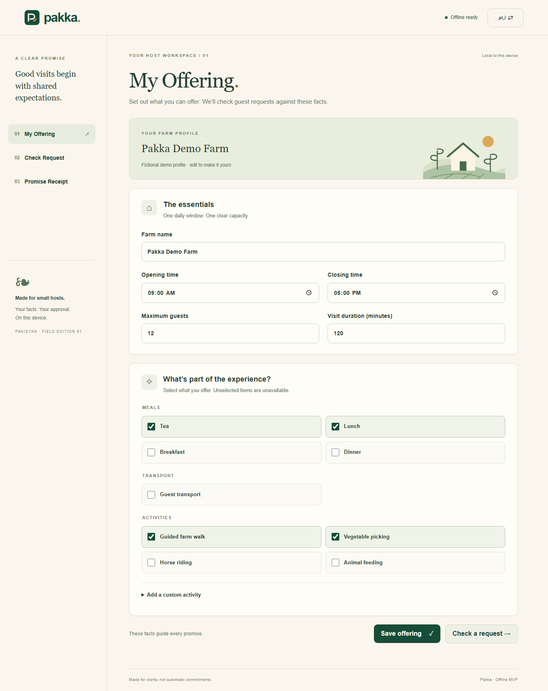

# Pakka · A clear promise

A mobile-first, offline farm-tourism MVP for small hosts in Pakistan. Compare an English guest request with the operator's actual offering, review every interpretation, then issue a fixed-template English/Urdu promise receipt.

**Live app:** [Open Pakka](https://avdol-13a.github.io/Pakka/) · **Team:** 2AM · [Submission fields and video checklist](docs/SUBMISSION.md)

**Exactly three screens:** My Offering → Check Request → Promise Receipt. No accounts, payments, messaging integrations, booking engine, voice feature, dashboard, or runtime cloud AI.



## Run locally

Requires Node.js 22 or newer and npm. Dependencies need an initial download; the app itself has no runtime external requests.

```sh
npm ci
npm run dev
```

For the offline-capable production build:

```sh
npm run build
npm run preview -- --port 4173
```

Open **http://127.0.0.1:4173**. Wait for **Offline ready**. Disconnect the network and reload. The preview server needs to serve the initial load; subsequent cached navigation and model inference work with the server/network unavailable. Development mode does not install the service worker.

For phone installation, serve the `dist` directory at an **HTTPS** origin. Open it once, wait for Offline ready, then use the browser's Install app / Add to Home Screen action. A phone's plain HTTP LAN address is not a secure context and cannot install the worker. Installation is optional for offline behavior after caching. Clearing site data or browser eviction removes local facts and cached resources. Clipboard access depends on the browser; selectable text and print are also provided.

## Use

1. Edit the clearly fictional Pakka Demo Farm profile. Save its hours, maximum guests, fixed visit duration, meals, transport, and activities. Custom activity names require English and Urdu supplied by the operator.
2. Paste **English only** guest text or try the three examples. Each card quotes the original sentence and shows the saved fact and comparison. Correct any extraction, add a missed detail, or dismiss irrelevant/duplicate material. Mark every card reviewed, including questions that remain unresolved.
3. Approve the reviewed snapshot. Copy or print the English/Urdu receipt. Only requested, approved supported items become inclusions. Exclusions and questions remain visible. **Guest agreement pending** never changes to a booking confirmation.

Edits invalidate approval. Unsaved offering edits must be saved before navigating away. Request drafts, saved facts, language, reviews, and approval snapshots persist under `pakka.v1` in localStorage. Storage failures are visibly reported. Another tab changing the same record requires reload rather than silently overwriting it.

## Actual evaluation

| Measure | Result |
|---|---:|
| Synthetic training / validation / held-out | 600 / 150 / 150 |
| Uncompressed vocabulary + weights + metadata | **21,283 bytes** |
| Classifier micro / macro F1 | **49.0% / 47.1%** |
| Keyword baseline micro / macro F1 | **74.3% / 72.1%** |
| Classifier exact-label match | **7.3%** |
| Keyword exact-label match | **25.3%** |

**The keyword baseline wins.** This compact experimental classifier does not generalize well to the held-out phrasing. Its score is a topic-mention score, not a confidence that a promise is safe. It is never the authority for fulfillment: explicit parsing, conservative clarification, saved host facts, and operator review determine the receipt. Read [per-label results and actual failures](docs/EVALUATION.md) and the [full machine-readable evaluation](docs/evaluation.json).

## Reproduce and verify

```sh
npm run train
npm test
npm run build
npx playwright install chromium
npm run test:e2e
```

Training uses a seeded, dependency-free Node script. It recreates the committed synthetic datasets, learns binary unigram/bigram logistic classifiers, chooses thresholds on validation only, and writes `public/model.json` plus evaluation artifacts. Model and held-out hashes are recorded in `docs/evaluation.json`. No API keys or model downloads are required.

See [verification details](docs/VERIFICATION.md), [model/data provenance](docs/MODEL_CARD.md), [three-minute live demo](docs/DEMO_SCRIPT.md), and [55-second narrated video](demo/pakka-demo.mp4). The video uses actual app footage and ElevenLabs narration; narration is **not** included in the app bundle.

To reproduce visuals, run the production preview and `node scripts/capture.mjs`. To reproduce the video using the included narration, run `node scripts/record-demo.mjs`; this uses Playwright and the development-only FFmpeg binary.

## Pakistan context and limits

The World Bank's [Promoting Responsible Tourism in Pakistan’s North](https://www.worldbank.org/en/news/feature/2023/11/01/promoting-responsible-tourism-in-pakistan-s-north), published 1 November 2023, describes responsible-tourism initiatives involving local communities and tourism businesses in Khyber Pakhtunkhwa. That is public development context, **not user research validating this product**. No field interviews, real farm data, or real guest requests are claimed here.

The farm and every training/example request are fictional. This MVP understands a deliberately narrow subset of English. It is **not general translation, unrestricted language understanding, date-specific availability, or a booking service**. Urdu is authored interface/template text, not machine translation; native-speaker review is needed before wider deployment. It uses device/system fonts, so Urdu appearance varies by OS. Browser testing covers Chromium emulation, not physical-device certification or every browser's installation workflow.

## Implementation map

- `src/domain.ts`: types, browser classifier, explicit parsing, comparisons, approval gate, bilingual receipt templates.
- `src/App.tsx`, `src/styles.css`: the three localized screens and responsive/print layout.
- `src/storage.ts`: persisted-state validation and approval revalidation.
- `scripts/train.mjs`, `data/`: model training and explicitly synthetic split data.
- `scripts/service-worker.mjs`: build-time asset enumeration and versioned offline cache.
- `tests/`: behavioral and production-browser checks; `.github/workflows/ci.yml`: reproducible CI.

React + TypeScript + Vite. Runtime assets are served locally from `dist`; no external fonts, analytics, accounts, or APIs. Demo/media tooling stays outside the app's `public` directory.
